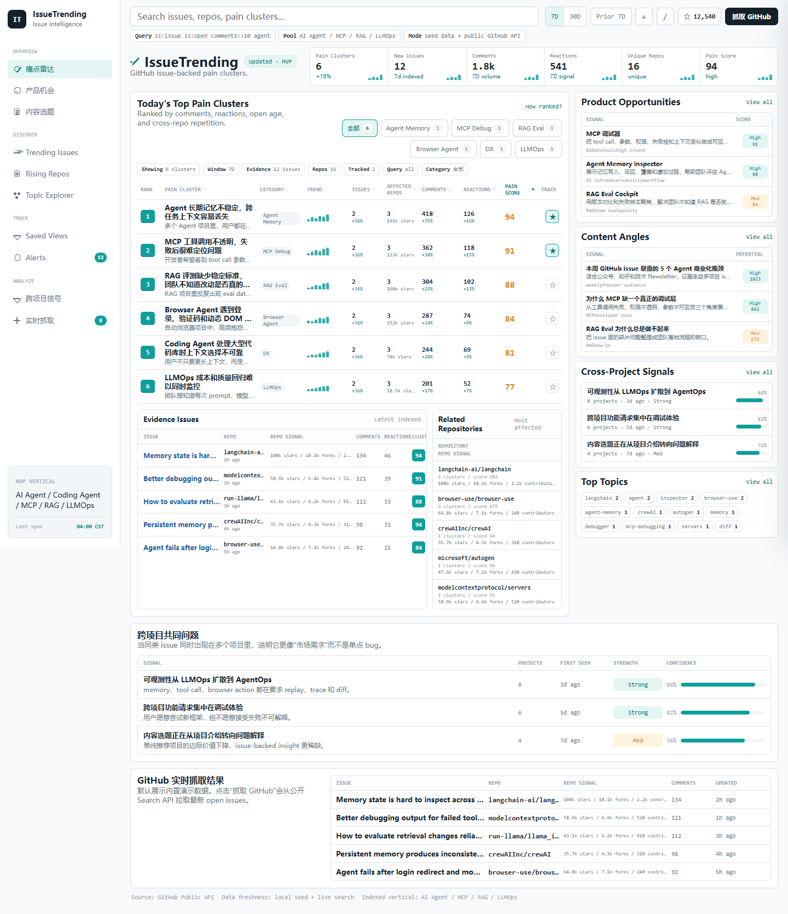
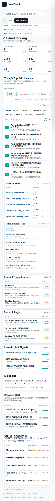

<p align="center">
  
</p>

<h1 align="center">IssueTrending</h1>

<p align="center">
  GitHub issue-backed intelligence for discovering developer pain points, product opportunities, and technical content angles.
</p>

<p align="center">
  <a href="https://harzva.github.io/IssueTrending/">Live Demo</a>
  ·
  <a href="#run-locally">Run Locally</a>
  ·
  <a href="#how-it-works">How It Works</a>
  ·
  <a href="#roadmap">Roadmap</a>
</p>

<p align="center">
  
  
  
</p>

<p align="center">
  
</p>

## Why IssueTrending

Most GitHub trend dashboards rank repositories by stars or forks. That is useful, but it misses a different signal: what developers are repeatedly struggling with inside issues.

IssueTrending turns GitHub issues into a compact product cockpit:

- **For builders:** find repeated pain points that may become tools, plugins, or SaaS ideas.
- **For product managers:** compare issue volume, comments, reactions, affected repos, and repo weight.
- **For technical creators:** turn real developer problems into daily content topics.

The current MVP focuses on AI Agent, MCP, RAG, and LLMOps repositories.

## Highlights

| Area | What it shows |
| --- | --- |
| Pain clusters | Ranked developer pain points with comments, reactions, open age, affected repos, and pain score |
| Evidence issues | Concrete issue examples behind each cluster |
| Repository signals | Stars, forks, contributors, and clickable GitHub repo links |
| Product opportunities | Tool or product ideas derived from repeated issue patterns |
| Content angles | Article/video topics backed by real issue evidence |
| Live panel | Seeded evidence rows by default, with optional GitHub Search API refresh |
| Hot Repo Pulse mode | Watchlist-based PR and issue radar with local snapshots, history comparison, and daily briefs |

## Hot Repo Pulse Mode

`hot-repo-pulse.html` is the repository-watch mode inside IssueTrending. It keeps
the IssueTrending brand and adds a focused workflow for popular repositories such
as `openai/codex`, `google-gemini/gemini-cli`, `aider-ai/aider`, `cline/cline`,
`RooCodeInc/Roo-Code`, and `opencode-ai/opencode`.

It reads `data/latest.json` and `data/snapshots/index.json`, compares the latest
snapshot with an older one, and links to generated Markdown briefs:

- `data/latest.md`
- `data/daily-brief.md`

Create or refresh local snapshot data:

```sh
node scripts/snapshot.mjs
```

Defaults live in `hotrepopulse.config.json`. CLI flags remain available for
one-off overrides, and `GITHUB_TOKEN` can be set for higher GitHub API limits.

## Product Surface

IssueTrending is intentionally designed as an **operational cockpit**, not a marketing landing page.

- Compact title and KPI strip
- Search, category filters, timeframe controls, sorting, and tracking
- Dense ranked table with stable row heights
- Evidence and repository panels in the first working surface
- Detail drawer that preserves context while showing source issues
- Mobile layout with no horizontal overflow

<p align="center">
  
</p>

## How It Works

The static MVP uses curated seed data plus optional public GitHub API calls.

```text
GitHub issues
  -> pain cluster
  -> score by comments, reactions, repo repetition, and open age
  -> evidence issues
  -> repo impact
  -> product opportunity
  -> content angle
```

The intended production architecture is:

```text
GitHub REST API
  + daily snapshots
  + candidate repository pool
  + ranking calculation
  + issue-backed insight generation
  + static/SSR dashboard
```

## Run Locally

From the repository root:

```powershell
python -m http.server 4173
```

Open:

```text
http://127.0.0.1:4173
```

Hot Repo Pulse mode:

```text
http://127.0.0.1:4173/hot-repo-pulse.html
```

No build step is required. The MVP is plain HTML, CSS, and JavaScript.

## GitHub Pages

The public demo is served from GitHub Pages:

```text
https://harzva.github.io/IssueTrending/
```

If you fork the project, enable GitHub Pages from:

```text
Settings -> Pages -> Deploy from branch -> main / root
```

## Project Structure

```text
.
├── index.html
├── styles.css
├── app.js
├── hot-repo-pulse.html
├── hot-repo-pulse.css
├── hot-repo-pulse.js
├── hotrepopulse.config.json
├── scripts/
│   └── snapshot.mjs
├── tests/
│   ├── fixtures/
│   │   └── github-snapshot-fixture.json
│   └── snapshot.test.mjs
├── data/
│   ├── latest.json
│   ├── latest.md
│   ├── daily-brief.md
│   ├── state.json
│   └── snapshots/
├── docs/
│   └── readme-assets/
│       ├── logo.svg
│       ├── issuetrending-dashboard.png
│       └── issuetrending-mobile.png
└── README.md
```

## Current Limits

- Default data is curated seed data so the dashboard works without credentials.
- The GitHub refresh button uses the public Search API and may hit unauthenticated rate limits.
- Contributor counts in the MVP are seeded repo metadata, not live per-request values.
- GitHub Pages deployment can lag behind `main` while Pages builds finish.

## Roadmap

- [ ] Cloudflare Workers deployment
- [ ] D1 database for daily repo and issue snapshots
- [ ] Scheduled GitHub sync with Cron
- [ ] Candidate repository pool from Trending, HotGit, topics, and tracked repos
- [ ] Daily / weekly / monthly issue and repo growth rankings
- [ ] LLM-generated issue summaries with source citations
- [ ] JSON-LD, sitemap, and `llms.txt`

## License

No license has been selected yet. Treat the repository as source-available until a license file is added.
