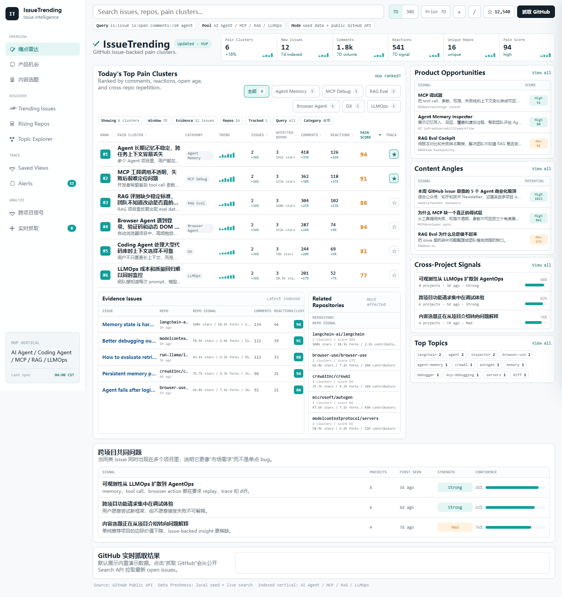

# IssueTrending

IssueTrending is a local web MVP for discovering developer pain points, product opportunities, and content angles from GitHub issues.

This version is a static product cockpit:

- Seeded AI/Agent/MCP/RAG/LLMOps issue intelligence data
- Pain-point ranking table with issue, comment, reaction, repo, and pain-score signals
- Repository impact metadata including stars, forks, and contributors
- Category filters, search, 7D/30D timeframe controls, and sorting
- Detail drawer with issue-backed evidence and repo-weighted inspector summary
- Product opportunity and content angle panels
- Optional GitHub Search API refresh button

## Screenshots



## Run Locally

From this directory:

```powershell
python -m http.server 4173
```

Then open:

```text
http://localhost:4173
```

## GitHub Pages

This project is pure static HTML/CSS/JavaScript. After pushing to GitHub, enable Pages from the repository root on the `main` branch.

## Current Limits

- The default dashboard uses curated seed data so the page works without API keys.
- The GitHub refresh button uses the public Search API and may hit unauthenticated rate limits.
- This is the web MVP before Cloudflare Workers, D1, scheduled sync, and stored daily reports.
